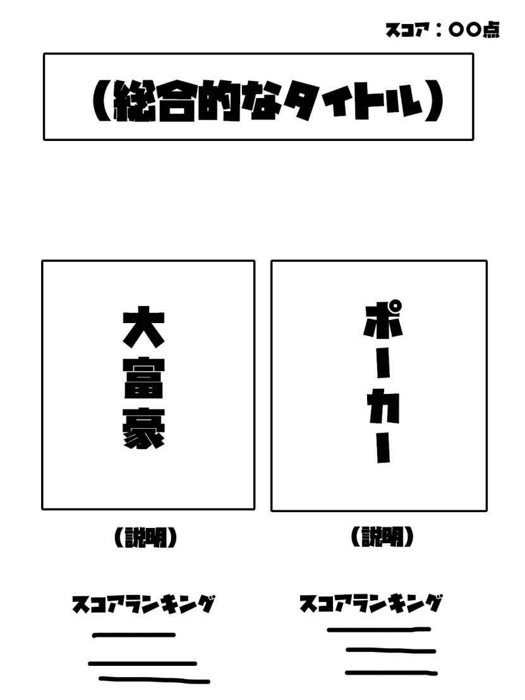
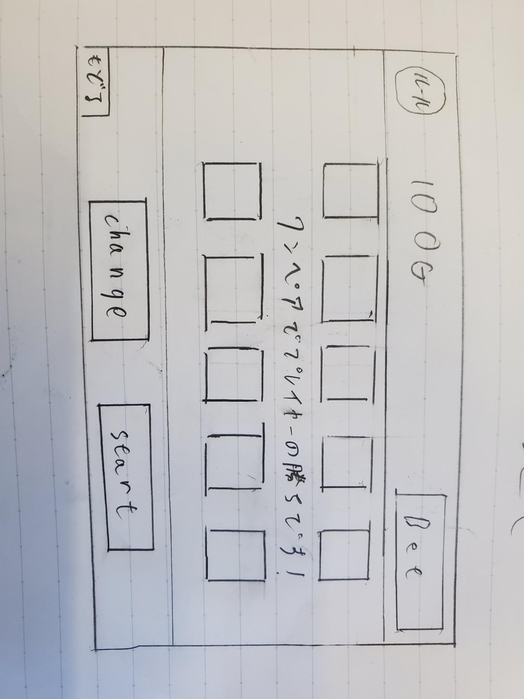
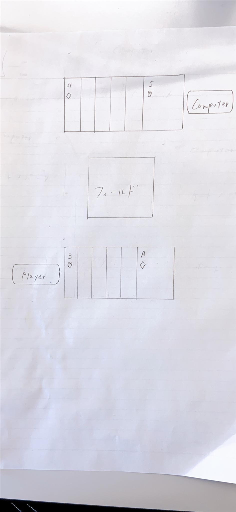

# オブジェクト指向プログラミングおよび演習 第14回進捗レポート

## 作成者
- 学籍番号：k20085
- 氏名：中根光貴
- グループ：1
    - メンバー
        - k19236 山本卓巳(チームリーダー)
        - k20001 相畑亮太(ポーカー)
        - k20003 青山隼人(ポーカー)
        - k20012 石原匠悟(ホーム)
        - k20035 加藤風真(ホーム)
        - k20055 後藤有杜(ポーカー)
        - k20077 角田亮平(大富豪)
        - k20085 中根光貴(大富豪)

## 仕様
- 全体
     - 双方のゲームでコインをベットをして、獲得する
     - コインは二つのゲームで共有される
     - コインを記録しておく場所はテキストファイル(自分だけがやる前提)
- ホーム画面
    - トップページから各ゲーム画面を表示する 
    - flameを用いて画面遷移する(参考 : https://office54.net/python/tkinter/screen-change-tkraise) 
    - トップページ用、大富豪用、ポーカー用の3つのflameを作る。それぞれ関数にしておくと後から便利 
    - 簡単な説明をする新しいウィンドウを生成する 
    - 現在のコインを表示する
- ポーカーゲーム
    - ベッド機能搭載
    - ゲームの流れ
        - ベッドボタンでベッドする
            - 所持金変動
        - 画面表示
        - (カードを選ぶ)
        - (changeを押す)
        - startを押して勝負
            - 相手のカードがchangeする
            - 自分の手札と相手の手札の勝敗判定
        - 結果表示
            - ボタンの文字をnextgameに変更
            - 所持金変動
        - 以上を繰り返す
    - ルールボタンを押すとHTMLのルール説明ページが表示される．
- 大富豪
    - 大富豪ができる
    - コンピュータと一対一の対戦
    - 勝利した時にポイントを付与

## アプリ完成イメージ
- メイン画面

- ポーカー画面

- 大富豪画面

## 作業分担
- リーダー新規作成
- ホーム画面
    - デザイン(k20012 石原匠悟)
    - 画面遷移の動き(k20035 加藤風真)
- ポーカーゲーム
    - ゲーム全体の制御(k20001 相畑亮太)
    - UI実装(k20003 青山隼人)
    - AI実装(k20055 後藤有杜)
- 大富豪
    - 大富豪の見た目の作成と操作するプレイヤーのカード処理（k20077 角田亮平）
    - CPUの決定アルゴリズムを作成(k20085 中根光貴)

## 作業報告
- プレイヤーのカードの処理を書いた
- 角田亮平と一緒に大富豪のバグを直そうとした

## グループ内でお世話になった人2〜3名を理由とともに挙げる
- 大富豪を一緒に作った(k20077 角田亮平)
- 結合とか(k19236 山本卓巳)

## 振り返り（感想含む）と次回までの作業予定
- 計画通りに作業は進んでいる
- ポーカーの人と何も話してない
- プレゼンテーションの資料はリーダーに任せている、大富豪の蘭は書いた
- 大富豪をくっつけてからは個人ではよくわからないので二人でやっているがうまく動かない、角田亮平の画面を見ながらこれやってみたらとかアドバイスしている
- 大富豪のバグというかTkinterの仕様で、作り直さないと直らない不具合が